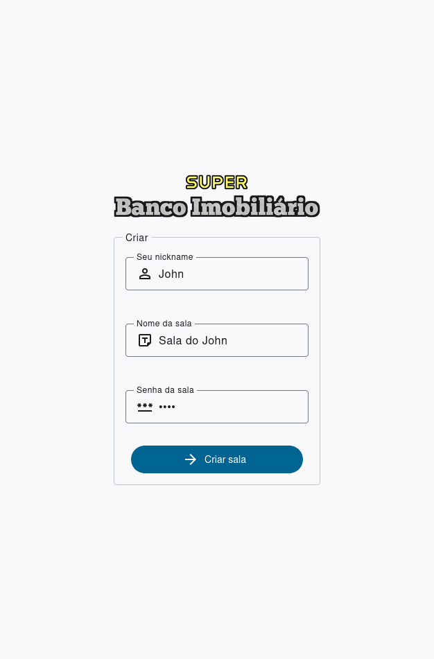
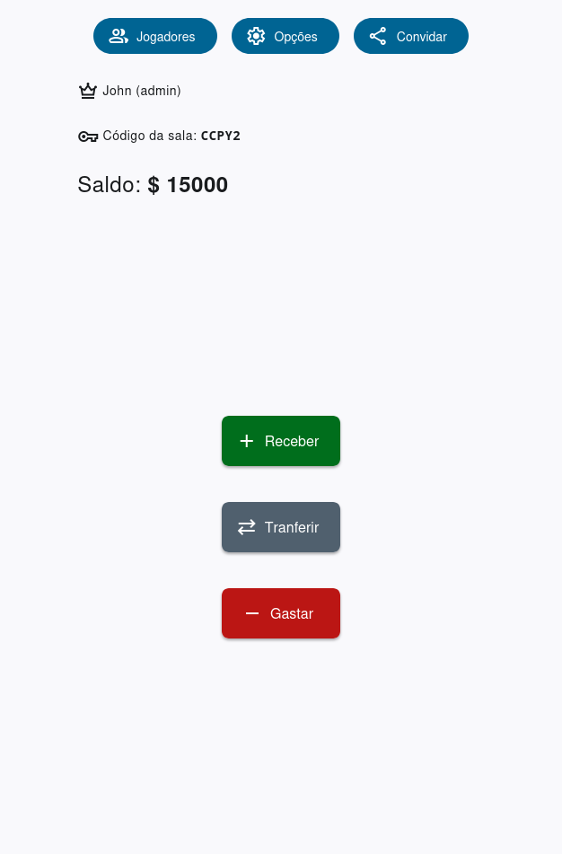
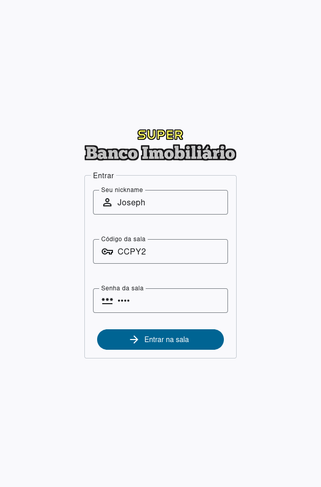
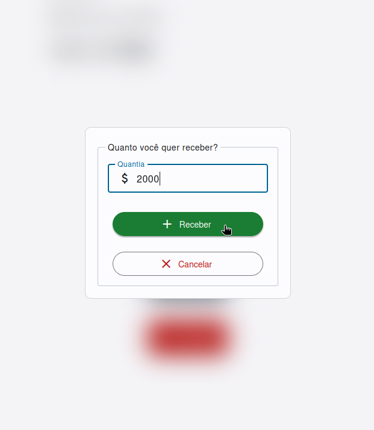

# 🏦 Super Banco Imobiliário

A modern, multiplayer digital version of the classic "Banco Imobiliário" (Brazilian Monopoly) built with React, Vite, Express (via Deno), Socket.IO, and SQLite. Play with your friends online, manage your money, and enjoy a seamless board game experience!

## 🖼️ Gallery

|   |   |   |
|---|---|---|
|   |   |   |

---

## 🚀 Features

- **Create or Join Rooms:** Instantly create a new game room or join an existing one with a unique code and password.
- **Real-Time Multiplayer:** Powered by Socket.IO for instant updates and player interactions.
- **Admin Controls:** The room creator is the admin and can approve/deny money requests.
- **Money Management:** Request, spend, or transfer money between players with admin approval.
- **Player List:** See all active players, their balances, and who’s the admin.
- **Secure Authentication:** JWT-based authentication for all actions.
- **Responsive UI:** Clean, modern interface built with React and Beercss.

---

## 🛠️ Tech Stack

- **Frontend:** React + Vite + Beercss + Socket.IO Client
- **Backend:** Express (via Deno), Socket.IO, SQLite
- **Authentication:** JWT (JSON Web Tokens)
- **Real-Time:** Socket.IO
- **Database:** SQLite

---

## 📦 Getting Started

### Prerequisites

- [Node.js](https://nodejs.org/) (for client)
- [Deno](https://deno.com/) (for server)

### Clone the Repository

```sh
git clone https://github.com/Magoninho/super-banco-imobiliario.git
cd super-banco-imobiliario
```

Setup the Server
```sh
cd server
deno install
deno -A main.ts
```

Setup the Client
```sh
cd client
npm install
npm run dev
```

---

## 📄 License
MIT

---

Made with ❤️ by João Felipe Ribeiro